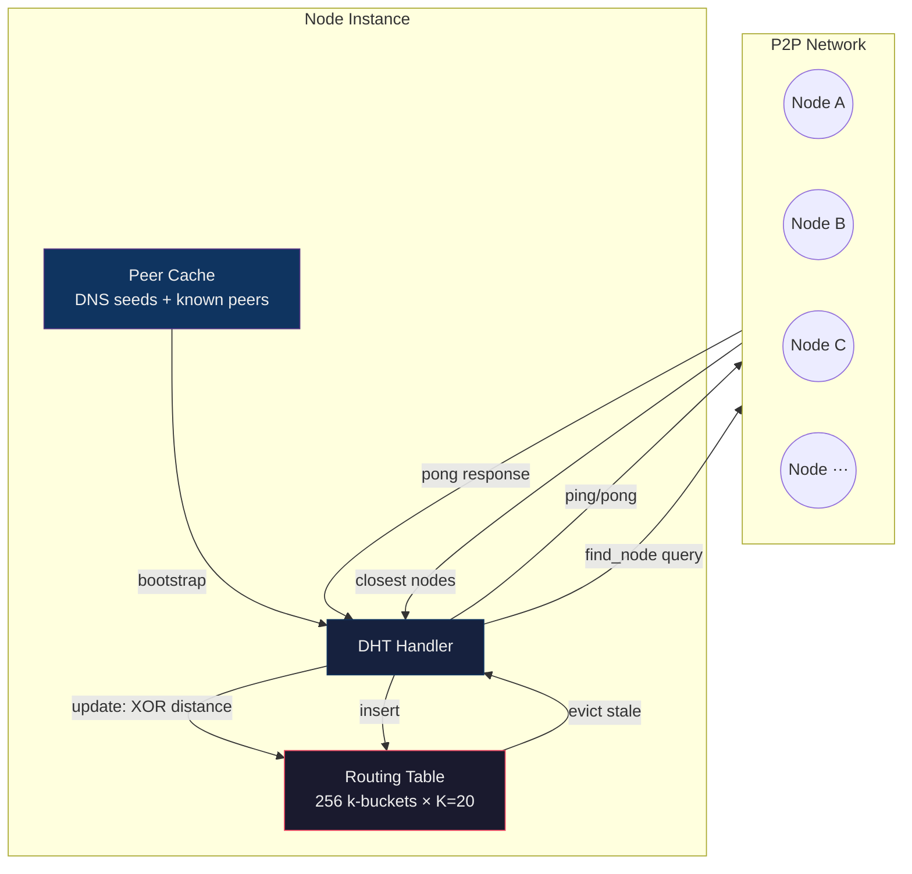
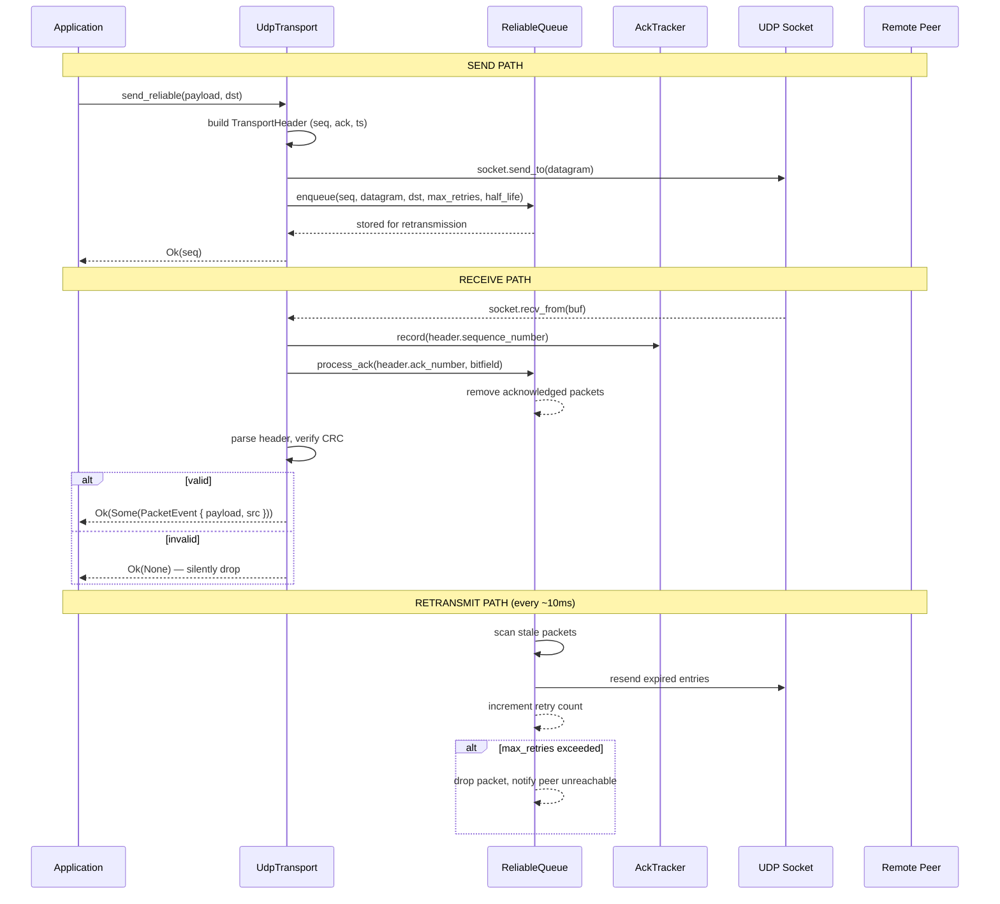
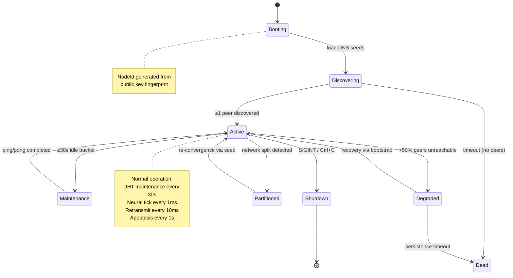
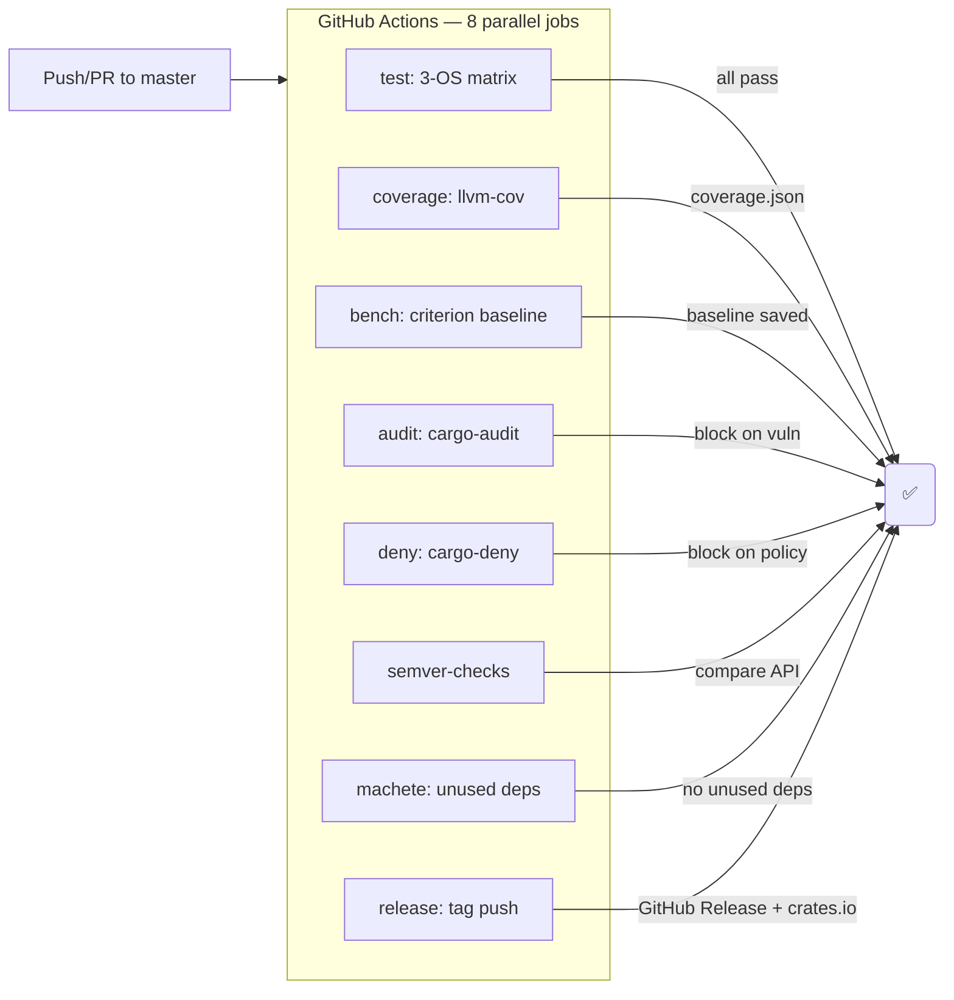

# Neuron-Wire Architecture Diagrams

> Mermaid.js diagrams — render on GitHub, [mdBook](https://rust-lang.github.io/mdBook/), or [mermaid.live](https://mermaid.live).

---

## 1. DHT Routing — Node Discovery & Bucket Maintenance



**Flow:**
1. Node boots → reads DNS seeds / peer cache
2. Sends `ping` to known peers, receives `pong` with NodeId
3. Computes XOR distance → inserts into correct k-bucket
4. Bucket full? → pings oldest entry → evicts if unresponsive
5. `find_node` floods to α closest buckets → returns K closest
6. Periodic maintenance: refresh buckets that haven't seen activity

---

## 2. Neural Learning Pipeline — Forward Pass → Hebbian STDP

```mermaid
flowchart LR
    subgraph Tick[One Engine Tick]
        direction TB
        A[Phase 1: Recv UDP]
        B[Phase 2: Drain outbound]
        C[Phase 3a: ForwardPass]
        D[Phase 3b: Hebbian STDP]
        E[Phase 4: Retransmit]
        F[Phase 5: Apoptosis]
        G[Phase 6: Yield]
    end

    subgraph Forward[Forward Pass — 6 sub-phases]
        F1[Leak: activation × 0.999]
        F2[Propagate: weighted sum of inputs]
        F3[Squash: tanh activation]
        F4[Observe: read input signal]
        F5[Predict: compute prediction]
        F6[Surprise: |prediction - observation|]
    end

    subgraph Hebbian[Hebbian STDP]
        H1[Pre-synaptic spike detected]
        H2[Weight update: Δw = η × pre × post]
        H3[Weight decay: w × 0.999/tick]
        H4[Micro-prune: |w| < 0.001 → remove]
        H5[Gossip: share weight gradients]
    end

    subgraph Plasticity[Neurogenesis & Apoptosis]
        NG[Surprise > threshold →<br/>birth new neuron]
        AP[Neuron inactive for N ticks →<br/>apoptosis signal]
        DS[Death spiral: cascading removal]
    end

    A -->|raw packets| C
    C --> F1 --> F2 --> F3 --> F4 --> F5 --> F6
    F6 -->|surprise signal| H1
    H1 --> H2 --> H3 --> H4 --> H5
    H5 -->|new connections| D
    F6 -->|high surprise| NG
    D --> E
    E -->|timers| F
    F -->|removal| DS
    F -->|birth| NG
    NG --> G
    DS --> G
```

---

## 3. Packet Flow — Send & Receive Lifecycle



---

## 4. Node State Machine



---

## 5. Subsystem Dependency Graph

```mermaid
graph TD
    LIB[lib.rs<br/>MAGIC, VERSION, deny(missing_docs)]
    
    subgraph Wire[Wire Protocol]
        H[header<br/>MessageHeader parse/build]
        TYPES[types<br/>MsgType, body layout]
        CRC[crc<br/>CRC32-C checksum]
        FLAT[flat<br/>FlatBuffer reader/writer]
        ZC[zerocopy<br/>Zero-copy helpers]
    end
    
    subgraph Network_IO[Network I/O]
        IO[io<br/>TCP frame read/write]
        TRANSPORT[transport<br/>UdpTransport, ReliableQueue]
    end
    
    subgraph Routing[DHT Routing]
        DHT[dht<br/>Kademlia DHT, k-buckets]
    end
    
    subgraph Neural[Neural Computation]
        FP[forward_pass<br/>Forward propagation]
        HEB[hebbian<br/>STDP learning]
        NG[neurogenesis<br/>Neuron birth]
        APO[apoptosis<br/>Neuron death]
        COMP[components<br/>ECS stores]
    end
    
    subgraph Engine[Engine]
        EL[engine_loop<br/>6-phase tick]
    end
    
    subgraph Testing[Testing & Simulation]
        SIM[simulator<br/>Multi-node harness]
        ADV[adversary<br/>Attack framework]
    end

    H --> CRC
    H --> TYPES
    H --> FLAT
    FLAT --> ZC
    
    IO --> H
    TRANSPORT --> H
    TRANSPORT --> CRC
    
    DHT --> H
    DHT --> TRANSPORT
    
    FP --> COMP
    HEB --> COMP
    NG --> COMP
    APO --> COMP
    
    EL --> H
    EL --> TRANSPORT
    EL --> DHT
    EL --> FP
    EL --> HEB
    EL --> NG
    EL --> APO
    
    SIM --> EL
    SIM --> DHT
    SIM --> ADV
    
    ADV --> H
    ADV --> TRANSPORT
    
    LIB --> H --> TYPES --> CRC
    LIB --> FLAT
    LIB --> IO
    LIB --> TRANSPORT
    LIB --> DHT
    LIB --> FP
    LIB --> HEB
    LIB --> NG
    LIB --> APO
    LIB --> COMP
    LIB --> EL
    LIB --> SIM
    LIB --> ADV
    LIB --> ZC
```

---

## 6. Engine Loop — 6-Phase Scheduler Timeline

```mermaid
gantt
    title Single Engine Tick (1ms)
    dateFormat X
    axisFormat %s

    section Phase 1
    Recv UDP (non-blocking)  :p1, 0, 1

    section Phase 2
    Drain outbound channel → send() :p2, 1, 2

    section Phase 3a
    Forward Pass: leak → propagate → squash → observe → predict → surprise :p3a, 2, 5

    section Phase 3b
    Hebbian STDP: update → decay → micro-prune → gossip :p3b, 5, 8

    section Phase 4
    Retransmit stale packets (every 10th tick) :p4, 8, 9

    section Phase 5
    Cleanup + Apoptosis (every 1000th tick) :p5, 9, 10

    section Phase 6
    Yield if busy, sleep until next tick :p6, 10, 10
```



**Timing characteristics:**
- **Idle (no data):** ~400K–1M ticks/second (phases 1, 6 dominate)
- **Active (neural load):** ~1,000 ticks/second (phases 3a, 3b dominate)
- **Phase 3a (ForwardPass):** O(N) where N = neuron count
- **Phase 3b (Hebbian):** O(N × K) where K = avg connections/neuron
- **Phase 4:** O(S) where S = stale packet count
- **Phase 5:** O(M) where M = dead neuron count
- **Phase 6:** sleep(remaining_ms) or yield() if overshot

---

## 7. CI Pipeline Flow



---

## 8. Test Suite Pyramid

```mermaid
graph TB
    subgraph Tests[126 Total Tests]
        FT[Fuzz: 1 target<br/>header_parse]
        PT[Property: 8 tests<br/>proptest invariants]
        IT[Integration: 8 tests<br/>protocol roundtrips]
        UT[Unit: 110 tests<br/>module-level assertions]
    end
    
    subgraph Benchmarks[14 Criterion]
        BH[Header: 4]
        BC[CRC: 1]
        BD[DHT: 4]
        BH2[Hebbian: 3]
        BF[ForwardPass: 2]
    end
    
    subgraph Quality[Enforcement]
        CLIP[clippy -D warnings]
        FMT[cargo fmt --check]
        AUD[cargo audit]
        DEN[cargo deny]
        MAC[cargo machete]
        DOCS[#[deny(missing_docs)]]
        PRE[pre-commit hook]
    end

    style Tests fill:#1a1a2e,stroke:#e94560
    style Benchmarks fill:#16213e,stroke:#0f3460
    style Quality fill:#0f3460,stroke:#533483
```
