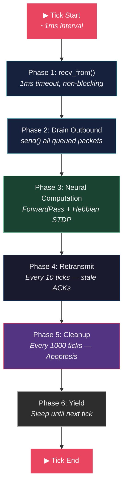
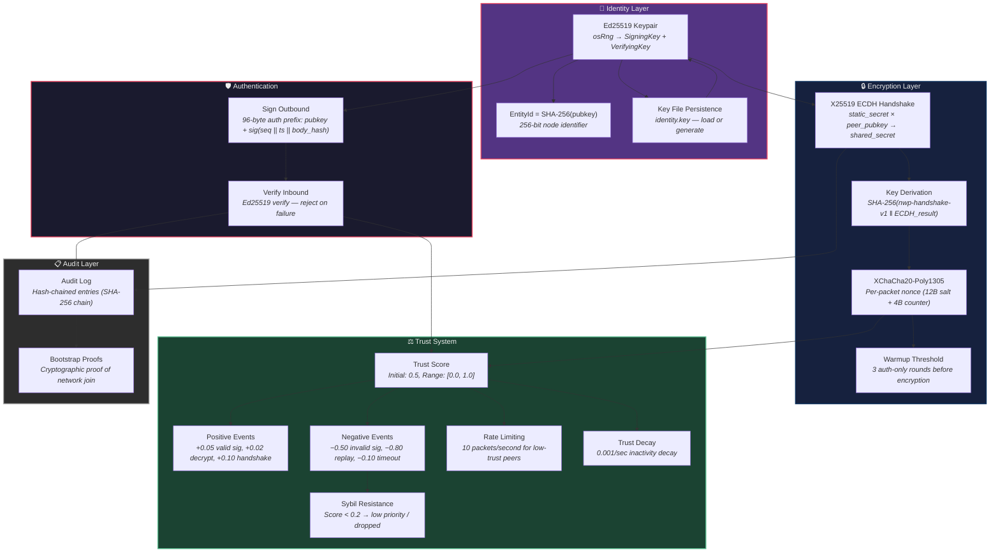

# Neuron Wire Protocol — Architecture

> **Version:** 0.3.0 · **Language:** Rust 1.87+ · **Edition:** 2021

---

## 1. System Overview

Neuron Wire Protocol (NWP) is a zero-copy, peer-to-peer infrastructure layer for decentralized AI. It implements a custom UDP transport with reliable delivery (selective ACK bitfields), a latency-weighted Kademlia DHT for peer discovery, and a single-threaded non-blocking event engine that processes packets at ~1ms tick intervals with zero busy-wait. Nodes authenticate via Ed25519 digital signatures, establish encrypted channels through static-static X25519 ECDH handshakes with XChaCha20-Poly1305 AEAD, and participate in a reputation-based trust system that provides Sybil resistance. The system supports distributed neural network computation including forward passes, Hebbian/STDP learning, gradient exchange, knowledge distillation, continual learning with meta-learning, and curiosity-driven exploration — all coordinated over a flat, zero-copy FlatBuffer wire format designed for constrained environments (512MB VPS).

---

## 2. Module Dependency Diagram

```mermaid
flowchart TD
    subgraph Core["🔧 Core Protocol"]
        lib["lib.rs<br/><i>Module re-exports, MAGIC, VERSION</i>"]
        header["header.rs<br/><i>16-byte NWP message header</i>"]
        flat["flat.rs<br/><i>FlatBuffer encoding/decoding</i>"]
        types["types.rs<br/><i>NeuronId, EntityId, core types</i>"]
        components["components.rs<br/><i>ActivationMap, SynapseMap</i>"]
        crc["crc.rs<br/><i>CRC32 integrity checks</i>"]
        zerocopy["zerocopy.rs<br/><i>Zero-copy buffer utilities</i>"]
        io["io.rs<br/><i>I/O helpers, re-exports</i>"]
    end

    subgraph Transport["📡 Transport Layer"]
        transport["transport.rs<br/><i>UDP socket, ACK bitfield, reliability</i>"]
        engine_loop["engine_loop.rs<br/><i>Single-thread event engine</i>"]
    end

    subgraph Security["🔐 Security / Identity"]
        identity["identity.rs<br/><i>Ed25519 keypairs, signatures</i>"]
        secure_channel["secure_channel.rs<br/><i>XChaCha20-Poly1305, ECDH handshake</i>"]
        trust["trust.rs<br/><i>Reputation scoring, Sybil resistance</i>"]
        audit["audit.rs<br/><i>Audit log, hash chain proofs</i>"]
        security["security.rs<br/><i>Unified security re-exports</i>"]
        stun["stun.rs<br/><i>NAT traversal, RFC 5389</i>"]
    end

    subgraph Network["🌐 DHT / Discovery"]
        dht["dht.rs<br/><i>Kademlia DHT, latency-weighted</i>"]
    end

    subgraph Neural["🧠 Neural Computation"]
        forward_pass["forward_pass.rs<br/><i>Signal propagation + prediction</i>"]
        hebbian["hebbian.rs<br/><i>STDP learning, micro-prune</i>"]
        attention["attention.rs<br/><i>Attention mechanisms</i>"]
        memory_module["memory_module.rs<br/><i>Memory consolidation</i>"]
        neurogenesis["neurogenesis.rs<br/><i>Dynamic node growth</i>"]
        apoptosis["apoptosis.rs<br/><i>Node pruning, cleanup</i>"]
        dynamic_activation["dynamic_activation.rs<br/><i>Runtime activation changes</i>"]
        adaptive_lr["adaptive_lr.rs<br/><i>Adaptive learning rate</i>"]
        curiosity["curiosity.rs<br/><i>Intrinsic motivation</i>"]
        uncertainty["uncertainty.rs<br/><i>Uncertainty estimation</i>"]
        sparse_tensor["sparse_tensor.rs<br/><i>Sparse tensor operations</i>"]
        routing["routing.rs<br/><i>Signal routing logic</i>"]
    end

    subgraph ML["🤖 ML / Training"]
        ml["ml.rs<br/><i>ML system coordination</i>"]
        distillation["distillation.rs<br/><i>Knowledge distillation</i>"]
        gradient_compression["gradient_compression.rs<br/><i>Gradient encoding</i>"]
        continual_learning["continual_learning.rs<br/><i>Non-forgetting training</i>"]
        meta_learning["meta_learning.rs<br/><i>Learning-to-learn</i>"]
        forgetting_bench["forgetting_bench.rs<br/><i>Catastrophic forgetting tests</i>"]
        distributed_replay["distributed_replay.rs<br/><i>Replay buffer coordination</i>"]
        adversary["adversary.rs<br/><i>Adversarial robustness</i>"]
    end

    subgraph Observability["📊 Monitoring"]
        health["health.rs<br/><i>HTTP health/metrics endpoint</i>"]
        observability["observability/<br/><i>Dashboard, metrics, SSE</i>"]
        logger["logger.rs<br/><i>Structured JSON logging</i>"]
    end

    subgraph Simulation["🔬 Simulation"]
        simulator["simulator.rs<br/><i>Full network simulator</i>"]
    end

    %% Core dependencies
    lib --> header
    lib --> flat
    lib --> types
    lib --> io
    header --> crc
    header --> components

    %% Transport depends on core
    transport --> header
    transport --> crc
    engine_loop --> transport
    engine_loop --> header
    engine_loop --> components
    engine_loop --> dht
    engine_loop --> forward_pass
    engine_loop --> hebbian
    engine_loop --> ml
    engine_loop --> neurogenesis
    engine_loop --> apoptosis
    engine_loop --> audit
    engine_loop --> identity
    engine_loop --> secure_channel
    engine_loop --> trust

    %% Security chain
    identity --> components
    secure_channel --> identity
    secure_channel --> components
    trust --> components
    audit --> identity
    security --> identity
    security --> secure_channel
    security --> trust
    security --> audit

    %% DHT
    dht --> header
    dht --> engine_loop

    %% Neural modules
    forward_pass --> components
    forward_pass --> sparse_tensor
    hebbian --> components
    hebbian --> adaptive_lr
    attention --> sparse_tensor
    memory_module --> components
    neurogenesis --> components
    neurogenesis --> types
    apoptosis --> components
    dynamic_activation --> components
    curiosity --> components
    uncertainty --> components
    routing --> components

    %% ML chain
    ml --> forward_pass
    ml --> hebbian
    ml --> attention
    ml --> memory_module
    ml --> adaptive_lr
    ml --> curiosity
    ml --> uncertainty
    distillation --> components
    distillation --> ml
    gradient_compression --> ml
    continual_learning --> ml
    continual_learning --> meta_learning
    meta_learning --> ml
    forgetting_bench --> continual_learning
    distributed_replay --> ml
    adversary --> ml
    adversary --> components

    %% Monitoring
    health --> engine_loop
    observability --> engine_loop

    %% Simulation
    simulator --> engine_loop
    simulator --> dht
    simulator --> trust

    %% Styling
    classDef core fill:#1a1a2e,stroke:#e94560,stroke-width:2px,color:#eee
    classDef transport fill:#16213e,stroke:#0f3460,stroke-width:2px,color:#eee
    classDef security fill:#533483,stroke:#e94560,stroke-width:2px,color:#eee
    classDef network fill:#0f3460,stroke:#53a8b6,stroke-width:2px,color:#eee
    classDef neural fill:#1b4332,stroke:#52b788,stroke-width:2px,color:#eee
    classDef ml fill:#3d0814,stroke:#f77f00,stroke-width:2px,color:#eee
    classDef obs fill:#2d2d2d,stroke:#a8a8a8,stroke-width:2px,color:#eee
    classDef sim fill:#1a1a1a,stroke:#c9b1ff,stroke-width:2px,color:#eee

    class lib,header,flat,types,components,crc,zerocopy,io core
    class transport,engine_loop transport
    class identity,secure_channel,trust,audit,security,stun security
    class dht network
    class forward_pass,hebbian,attention,memory_module,neurogenesis,apoptosis,dynamic_activation,adaptive_lr,curiosity,uncertainty,sparse_tensor,routing neural
    class ml,distillation,gradient_compression,continual_learning,meta_learning,forgetting_bench,distributed_replay,adversary ml
    class health,observability,logger obs
    class simulator sim
```



---

## 3. Data Flow Diagram

### Packet Ingress (UDP → Engine → Brain)

```mermaid
flowchart LR
    subgraph Network["🌐 Network"]
        UDP["UDP Socket<br/><i>recv_from()</i>"]
    end

    subgraph Transport["📡 Transport Layer"]
        TH["Transport Header<br/><i>seq, ack, bitfield, ts</i>"]
        RELIABILITY["Reliability Check<br/><i>ACK tracking, dedup</i>"]
        RETRANSMIT["Retransmit Queue<br/><i>stale packets, retries</i>"]
    end

    subgraph Security["🔐 Security"]
        AUTH["Auth Verify<br/><i>Ed25519 signature check</i>"]
        DECRYPT["Decrypt<br/><i>XChaCha20-Poly1305</i>"]
        TRUST_CHECK["Trust Check<br/><i>Sybil threshold, rate limit</i>"]
    end

    subgraph Engine["⚙️ Engine Loop (1ms tick)"]
        PARSE["Parse NWP Header<br/><i>magic, version, type, flags</i>"]
        DISPATCH["Event Dispatch<br/><i>Route by MessageType</i>"]
    end

    subgraph Neural["🧠 Neural Computation"]
        FP["Forward Pass<br/><i>Signal propagation + prediction</i>"]
        HEBB["Hebbian Learning<br/><i>STDP + micro-prune</i>"]
        ML_SYS["ML System<br/><i>Training coordination</i>"]
    end

    subgraph Output["📤 Egress"]
        OUTBOUND["Outbound Channel<br/><i>mpsc::Sender</i>"]
        SEND["UDP Socket<br/><i>send_to()</i>"]
    end

    UDP -->|"16B Transport Header + NWP Frame"| TH
    TH --> RELIABILITY
    RELIABILITY -->|"ACK/dedup"| AUTH
    AUTH -->|"verify pubkey + sig"| DECRYPT
    DECRYPT -->|"AEAD decrypt if enabled"| TRUST_CHECK
    TRUST_CHECK -->|"check score ≥ 0.2"| PARSE
    PARSE --> DISPATCH
    DISPATCH -->|"SPIKE / DATA / CONSENSUS"| FP
    DISPATCH -->|"GRADIENT / GOSSIP"| HEBB
    DISPATCH -->|"COMMAND / TRAINING"| ML_SYS
    FP --> OUTBOUND
    HEBB --> OUTBOUND
    ML_SYS --> OUTBOUND
    OUTBOUND --> SEND
    SEND --> UDP

    classDef net fill:#16213e,stroke:#53a8b6,stroke-width:2px,color:#eee
    classDef sec fill:#533483,stroke:#e94560,stroke-width:2px,color:#eee
    classDef eng fill:#1a1a2e,stroke:#e94560,stroke-width:2px,color:#eee
    classDef neur fill:#1b4332,stroke:#52b788,stroke-width:2px,color:#eee
    classDef out fill:#2d2d2d,stroke:#a8a8a8,stroke-width:2px,color:#eee

    class UDP net
    class TH,RELIABILITY,RETRANSMIT net
    class AUTH,DECRYPT,TRUST_CHECK sec
    class PARSE,DISPATCH eng
    class FP,HEBB,ML_SYS neur
    class OUTBOUND,SEND out
```



### Packet Egress (Brain → Engine → UDP)

```mermaid
flowchart RL
    subgraph Brain["🧠 Neural Output"]
        RESULT["Computation Result<br/><i>gradients, spikes, acks</i>"]
    end

    subgraph Engine["⚙️ Engine Loop"]
        ENQUEUE["Enqueue OutgoingPacket<br/><i>via mpsc::Sender</i>"]
        DRAIN["Drain Outbound Channel<br/><i>every tick</i>"]
    end

    subgraph Security["🔐 Security"]
        SIGN["Sign Packet<br/><i>Ed25519 signature</i>"]
        ENCRYPT["Encrypt Payload<br/><i>XChaCha20-Poly1305</i>"]
    end

    subgraph Transport["📡 Transport Layer"]
        NWP_HDR["NWP Header<br/><i>magic + version + type + flags + body_len + crc</i>"]
        TRANS_HDR["Transport Header<br/><i>seq + ack + bitfield + ts</i>"]
    end

    subgraph Network["🌐 Network"]
        UDP_OUT["UDP Socket<br/><i>send_to(peer)</i>"]
    end

    RESULT --> ENQUEUE
    ENQUEUE --> DRAIN
    DRAIN --> SIGN
    SIGN --> ENCRYPT
    ENCRYPT --> NWP_HDR
    NWP_HDR --> TRANS_HDR
    TRANS_HDR --> UDP_OUT

    classDef neur fill:#1b4332,stroke:#52b788,stroke-width:2px,color:#eee
    classDef eng fill:#1a1a2e,stroke:#e94560,stroke-width:2px,color:#eee
    classDef sec fill:#533483,stroke:#e94560,stroke-width:2px,color:#eee
    classDef net fill:#16213e,stroke:#53a8b6,stroke-width:2px,color:#eee

    class RESULT neur
    class ENQUEUE,DRAIN eng
    class SIGN,ENCRYPT sec
    class NWP_HDR,TRANS_HDR net
    class UDP_OUT net
```



### Engine Loop Tick Phases



---

## 4. Security Architecture



### Security Properties Table

| Layer | Mechanism | Library | Purpose |
|-------|-----------|---------|---------|
| **Signing** | Ed25519 | `ed25519-dalek` | Non-repudiation, identity proof |
| **Encryption** | XChaCha20-Poly1305 | `chacha20poly1305` | Confidentiality, integrity |
| **Key Exchange** | X25519 ECDH | `x25519-dalek` | Shared secret derivation |
| **Hashing** | SHA-256, Blake2 | `sha2`, `blake2` | EntityId derivation, key derivation, audit chain |
| **Replay Protection** | Monotonic nonce counter | custom | 1024-entry ring buffer, 1M drift window |
| **Trust Scoring** | Behavioral reputation | custom | Sybil resistance, rate limiting |
| **Audit Trail** | SHA-256 hash chain | custom | Tamper-evident event log |

---

## 5. Deployment Diagram

```mermaid
flowchart TB
    subgraph Node["🖥️ NWP Node (single process)"]
        subgraph Threads["Thread Pool"]
            ENGINE["Engine Thread<br/><i>Single-thread event loop</i>"]
            HEALTH["Health Thread<br/><i>HTTP /health, /metrics, /status</i>"]
            DASHBOARD["Dashboard Thread<br/><i>Charts + SSE on :9090</i>"]
            BRIDGE["Stats Bridge Thread<br/><i>1Hz EngineStats → Dashboard</i>"]
        end

        subgraph EngineInner["Engine Loop Internals"]
            UDP_SOCK["UDP Socket<br/><i>bind 0.0.0.0:9000</i>"]
            DHT_MOD["DHT Handler<br/><i>Kademlia routing table</i>"]
            TRUST_MOD["Trust System<br/><i>Peer scoring + rate limiting</i>"]
            SECURE_CH["Secure Channel<br/><i>Per-peer encryption state</i>"]
            ML_MOD["ML System<br/><i>Forward pass + Hebbian</i>"]
        end

        CONFIG["node-config.toml<br/><i>+ NWP_* env overrides</i>"]
        IDENTITY["identity.key<br/><i>Ed25519 persisted keypair</i>"]
    end

    subgraph DHT_Network["🌐 DHT Network"]
        BOOTSTRAP["Bootstrap Peers<br/><i>Configured or DNS seeds</i>"]
        SEED_DNS["DNS Seeds<br/><i>_dht.seeds.&lt;domain&gt;</i>"]
        PEER_CACHE["Peer Cache File<br/><i>Persistence across restarts</i>"]
    end

    subgraph Peers["👥 Peer Nodes"]
        PEER1["Peer Node A<br/><i>NAT'd / public</i>"]
        PEER2["Peer Node B<br/><i>NAT'd / public</i>"]
        PEER3["Peer Node C<br/><i>NAT'd / public</i>"]
        PEER_N["Peer Node N<br/><i>... (up to 500)</i>"]
    end

    subgraph External["🌍 External Services"]
        STUN_SVR["STUN Server<br/><i>stun.l.google.com:19302</i>"]
        MONITOR["Prometheus / Grafana<br/><i>Scrapes /metrics</i>"]
        VERCEL["Dashboard Frontend<br/><i>neuron-wire-dashboard.vercel.app</i>"]
    end

    CONFIG --> ENGINE
    IDENTITY --> ENGINE

    ENGINE <-->|"UDP"| DHT_MOD
    ENGINE <-->|"UDP"| SECURE_CH
    ENGINE --> TRUST_MOD
    ENGINE --> ML_MOD

    HEALTH <-->|"Arc&lt;Mutex&lt;EngineStats&gt;&gt;"| ENGINE
    DASHBOARD <-->|"MetricsRegistry"| ENGINE
    BRIDGE -->|"1Hz poll"| HEALTH
    BRIDGE -->|"set_gauge"| DASHBOARD

    DHT_MOD <-->|"Gossip / FindNode"| BOOTSTRAP
    DHT_MOD <-->|"DNS lookup"| SEED_DNS
    DHT_MOD <-->|"Load/Save"| PEER_CACHE

    UDP_SOCK <-->|"NWP frames"| PEER1
    UDP_SOCK <-->|"NWP frames"| PEER2
    UDP_SOCK <-->|"NWP frames"| PEER3
    UDP_SOCK <-->|"NWP frames"| PEER_N

    ENGINE -->|"Binding Request"| STUN_SVR

    MONITOR -->|"HTTP GET /metrics"| HEALTH
    VERCEL -->|"SSE / charts"| DASHBOARD

    style Node fill:#1a1a2e,stroke:#e94560,stroke-width:2px,color:#eee
    style DHT_Network fill:#0f3460,stroke:#53a8b6,stroke-width:2px,color:#eee
    style Peers fill:#1b4332,stroke:#52b788,stroke-width:2px,color:#eee
    style External fill:#2d2d2d,stroke:#a8a8a8,stroke-width:2px,color:#eee
```



### Port Map

| Port | Protocol | Service | Default Bind |
|------|----------|---------|--------------|
| 9000 | UDP | NWP Engine (main) | `0.0.0.0:9000` |
| 9100 | TCP | Health/Metrics HTTP | `127.0.0.1:9100` |
| 9090 | TCP | Dashboard (charts + SSE) | `0.0.0.0:9090` |
| *dynamic* | UDP | DHT listen (if different from engine) | config |
| *dynamic* | UDP | STUN (outbound to server) | ephemeral |

### Environment Variables (12-Factor)

| Variable | Config Path | Default |
|----------|-------------|---------|
| `NWP_NAME` | `node.name` | `nwp-node` |
| `NWP_BIND_ADDR` | `node.bind_addr` | `0.0.0.0:9000` |
| `NWP_TICK_INTERVAL_MS` | `node.tick_interval_ms` | `1` |
| `NWP_STUN_ENABLED` | `stun.enabled` | `false` |
| `NWP_STUN_SERVER` | `stun.server` | `stun.l.google.com:19302` |
| `NWP_DHT_ENABLED` | `dht.enabled` | `true` |
| `NWP_BOOTSTRAP_PEERS` | `dht.bootstrap_peers` | `[]` |
| `NWP_PEER_CACHE_PATH` | `dht.peer_cache_path` | `None` |
| `NWP_TRUST_CACHE_PATH` | `dht.trust_cache_path` | `None` |
| `NWP_SEED_DOMAIN` | `dht.seed_domain` | `""` |
| `NWP_SIGN_PACKETS` | `security.sign_packets` | `true` |
| `NWP_ENCRYPT_PAYLOADS` | `security.encrypt_payloads` | `false` |
| `NWP_HEALTH_BIND` | — | `127.0.0.1:9100` |
| `NWP_DASHBOARD_BIND` | — | `0.0.0.0:9090` |

---

## 6. Component Matrix

| Module | Purpose | Lines | Tests |
|--------|---------|------:|------:|
| `adaptive_lr` | Adaptive learning rate scheduling for Hebbian/STDP | 186 | 2 |
| `adversary` | Adversarial robustness testing and perturbation | 759 | 7 |
| `apoptosis` | Node pruning and cleanup based on fitness scores | 306 | 5 |
| `attention` | Attention mechanism for signal prioritization | 466 | 7 |
| `audit` | Hash-chained audit log with bootstrap proofs | 537 | 6 |
| `components` | Core data types: EntityId, ActivationMap, SynapseMap | 174 | 4 |
| `continual_learning` | Non-forgetting distributed training pipeline | 207 | 3 |
| `crc` | CRC32 integrity verification for NWP frames | 48 | 5 |
| `curiosity` | Intrinsic motivation for exploration-driven learning | 265 | 5 |
| `dht` | Latency-weighted Kademlia DHT for peer discovery | 1222 | 7 |
| `distillation` | Knowledge distillation between nodes | 364 | 12 |
| `distributed_replay` | Distributed experience replay buffer coordination | 293 | 8 |
| `dynamic_activation` | Runtime dynamic activation function changes | 380 | 13 |
| `engine_loop` | Single-thread non-blocking event engine (core) | 1434 | 9 |
| `flat` | FlatBuffer zero-copy encoding/decoding | 236 | 3 |
| `forgetting_bench` | Catastrophic forgetting benchmark tests | 447 | 8 |
| `forward_pass` | Signal propagation and prediction | 413 | 7 |
| `gradient_compression` | Gradient encoding for bandwidth-efficient exchange | 496 | 9 |
| `header` | 16-byte NWP message header (magic, version, type, flags) | 358 | 11 |
| `health` | Zero-dep HTTP health/metrics endpoint (:9100) | 275 | 0 |
| `hebbian` | STDP learning, micro-prune, and gossip | 683 | 9 |
| `identity` | Ed25519 keypairs, signatures, EntityId derivation | 463 | 7 |
| `io` | I/O utilities and re-exports | 167 | 4 |
| `lib` | Crate root: module declarations, constants, re-exports | 82 | 0 |
| `logger` | Lightweight structured JSON logger (zero deps) | 326 | 5 |
| `memory_module` | Memory consolidation and retrieval | 281 | 6 |
| `meta_learning` | Learning-to-learn (MAML-style adaptation) | 342 | 4 |
| `ml` | ML system coordination and orchestration | 392 | 4 |
| `neurogenesis` | Dynamic node growth based on demand signals | 340 | 9 |
| `observability/` | Dashboard (SSE), metrics registry, Prometheus, OpenTelemetry | 1372 | 0 |
| `routing` | Signal routing between nodes | 156 | 3 |
| `secure_channel` | XChaCha20-Poly1305 encrypted transport + ECDH handshake | 653 | 5 |
| `security` | Unified security subsystem re-exports | 32 | 0 |
| `simulator` | Full network simulator for testing | 1519 | 9 |
| `sparse_tensor` | Sparse tensor operations for neural computation | 390 | 9 |
| `stun` | STUN NAT traversal client (RFC 5389) | 531 | 5 |
| `transport` | UDP transport with ACK bitfield reliability | 650 | 8 |
| `trust` | Reputation scoring, Sybil resistance, rate limiting | 558 | 8 |
| `types` | Core type definitions (NeuronId, EntityId, etc.) | 423 | 13 |
| `uncertainty` | Uncertainty estimation for predictions | 426 | 8 |
| `zerocopy` | Zero-copy buffer utilities | 176 | 5 |

**Total: 40 modules · 17,662 lines · 234 tests**

### Dependencies (from `Cargo.toml`)

| Category | Crate | Purpose |
|----------|-------|---------|
| **Crypto** | `ed25519-dalek` | Ed25519 signing/verification |
| **Crypto** | `x25519-dalek` | X25519 ECDH key exchange |
| **Crypto** | `chacha20poly1305` | XChaCha20-Poly1305 AEAD |
| **Crypto** | `blake2` | Blake2 hashing |
| **Crypto** | `sha2` | SHA-256 hashing |
| **Data** | `crc32fast` | Fast CRC32 |
| **Data** | `rand` | Cryptographic randomness |
| **Data** | `serde` + `serde_json` | Serialization |
| **Data** | `toml` | Config file parsing |
| **Data** | `csv` | CSV parsing |
| **Data** | `hex`, `base64` | Encoding utilities |
| **Safety** | `zeroize` | Secure memory zeroing |
| **Platform** | `ctrlc` (Unix) | Signal handling |

### Wire Format

```text
┌─────────────────────────────────────────────────────────────────┐
│                     NWP Packet (UDP)                            │
├──────────┬──────────┬──────────┬──────────┬─────────────────────┤
│  seq(4)  │ ack(4)   │ bit(4)   │ ts(4)    │  NWP Frame         │
│  u32     │ u32      │ u32      │ u32      │                    │
├──────────┴──────────┴──────────┴──────────┼────────┬────────────┤
│         Transport Header (16 bytes)       │frame_len│ 4 bytes   │
├───────────────────────────────────────────┼────────┼────────────┤
│         NWP Message Header (16 bytes)     │ magic(4)│ "NWP\0"   │
│                                           │ ver(1)  │ 2          │
│                                           │ type(1) │ msg type   │
│                                           │ flags(1)│ sec flags  │
│                                           │ body_len│ 4 bytes    │
│                                           │ crc(4)  │ CRC32      │
├───────────────────────────────────────────┼────────┼────────────┤
│  [Optional: Auth Prefix (96 bytes)]       │ pub(32) │ Ed25519 pk │
│                                           │ sig(64) │ signature  │
├───────────────────────────────────────────┼────────┼────────────┤
│  [Optional: Encryption Nonce (16 bytes)]  │ salt(12)│ + ctr(4)  │
├───────────────────────────────────────────┼────────┼────────────┤
│         FlatBuffer Body (0..1GB)          │         │            │
└───────────────────────────────────────────┴────────┴────────────┘
```
